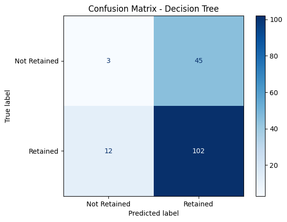
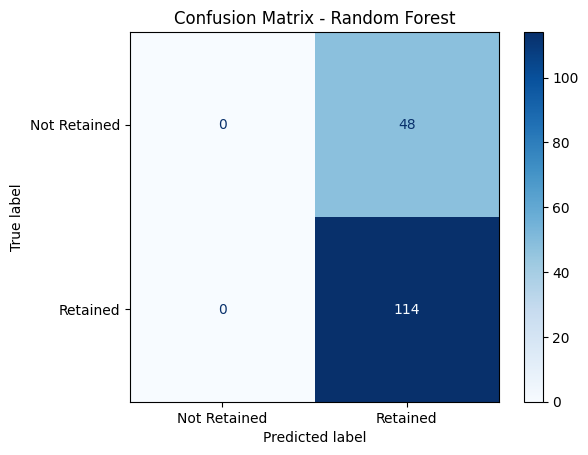

# 📊 Big Data Analytics: Customer Retention Prediction

[](https://www.python.org/downloads/)
[](https://spark.apache.org/)
[](LICENSE)

> Sistem prediksi retensi pelanggan berbasis Big Data menggunakan Apache Spark, PySpark, dan Hadoop dengan implementasi algoritma Machine Learning (Logistic Regression, Decision Tree, dan Random Forest).


## 🎯 Deskripsi Project

Project ini merupakan implementasi sistem prediksi retensi pelanggan yang memanfaatkan teknologi Big Data untuk menganalisis pola perilaku pelanggan dan memprediksi kemungkinan customer churn. Sistem ini dibangun menggunakan Apache Spark untuk pemrosesan data terdistribusi dan Hadoop HDFS untuk penyimpanan data.

### ✨ Fitur Utama

- ⚡ **ETL Pipeline** berbasis Apache Spark
- 🤖 **Tiga Model ML**: Logistic Regression, Decision Tree, Random Forest
- 📈 **Visualisasi Interaktif** menggunakan Matplotlib
- 🎯 **Evaluasi Komprehensif**: Accuracy, Precision, Recall, F1-Score
- 💾 **Data Storage** di Hadoop HDFS
- 📊 **Dashboard Analytics**

## 🏗️ Arsitektur Sistem
```
┌─────────────┐     ┌──────────────┐     ┌─────────────┐
│   HDFS      │────▶│ Apache Spark │────▶│  PySpark    │
│  Storage    │     │  Processing  │     │   MLlib     │
└─────────────┘     └──────────────┘     └─────────────┘
                            │
                            ▼
                    ┌──────────────┐
                    │ Visualization│
                    │  & Results   │
                    └──────────────┘
```

## 📊 Hasil Performance

| Model                | Accuracy | Precision | Recall | F1-Score |
|---------------------|----------|-----------|--------|----------|
| Logistic Regression | 70.37%   | 0.71      | 0.69   | 0.70     |
| Decision Tree       | 64.81%   | 0.69      | 0.89   | 0.78     |
| Random Forest       | 70.37%   | 0.73      | 0.68   | 0.70     |

### 📈 Confusion Matrix

<p align="center">
  
  
  
</p>

## 🚀 Teknologi yang Digunakan

### Big Data Stack
- **Apache Hadoop 3.x** - Distributed Storage (HDFS)
- **Apache Spark 3.5.5** - Distributed Processing
- **PySpark** - Python API for Spark

### Machine Learning
- **Spark MLlib** - Distributed ML Library
- **Scikit-learn** - Model Evaluation

### Visualization
- **Matplotlib** - Statistical Visualization
- **Seaborn** - Enhanced Visualization

### Development Tools
- **Jupyter Notebook** - Interactive Development
- **Anaconda 3** - Package Management
- **Python 3.8+** - Programming Language

## 📋 Prerequisites

- Java 8 atau lebih tinggi
- Python 3.8+
- Apache Hadoop 3.x
- Apache Spark 3.5.5
- Anaconda atau Miniconda

## 🔧 Instalasi

### 1. Clone Repository
```bash
git clone https://github.com/username/big-data-customer-retention.git
cd big-data-customer-retention
```

### 2. Setup Environment
```bash
# Buat virtual environment
conda create -n bigdata python=3.8
conda activate bigdata

# Install dependencies
pip install -r requirements.txt
```

### 3. Konfigurasi Hadoop
```bash
# Set environment variables
export HADOOP_HOME=/path/to/hadoop
export PATH=$PATH:$HADOOP_HOME/bin:$HADOOP_HOME/sbin

# Start Hadoop
start-dfs.sh
start-yarn.sh
```

### 4. Konfigurasi Spark
```bash
# Set environment variables
export SPARK_HOME=/path/to/spark
export PATH=$PATH:$SPARK_HOME/bin

# Verify installation
spark-shell --version
```

## 💻 Cara Menggunakan

### 1. Upload Data ke HDFS
```bash
# Buat direktori di HDFS
hdfs dfs -mkdir -p /user/$(whoami)/dataset

# Upload dataset
hdfs dfs -put data/raw/customer_experience_data.csv /user/$(whoami)/dataset/
```

### 2. Jalankan Notebook
```bash
jupyter notebook notebooks/FIX_cust-experience.ipynb
```

### 3. Atau Jalankan via Script
```bash
spark-submit src/model_training.py
```

## 📁 Struktur Data

Dataset yang digunakan: [Customer Experience Dataset](https://www.kaggle.com/datasets/ziya07/customer-experience-dataset)

### Fitur Dataset

| Kolom | Tipe | Deskripsi |
|-------|------|-----------|
| Customer_ID | Integer | ID unik pelanggan |
| Age | Integer | Usia pelanggan |
| Gender | String | Jenis kelamin |
| Num_Interactions | Integer | Jumlah interaksi |
| Feedback_Score | Integer | Skor feedback |
| Products_Purchased | Integer | Jumlah produk dibeli |
| Time_Spent_on_Site | Double | Waktu di situs |
| Satisfaction_Score | Integer | Skor kepuasan |
| Retention_Status | String | Status retensi (Target) |

## 🔍 Pipeline Machine Learning

### 1. Data Preprocessing
- Penghapusan duplikat
- Handling missing values
- Feature encoding (StringIndexer)
- Feature engineering
- Scaling (StandardScaler)

### 2. Model Training
```python
# Split data
train_data, test_data = assembled_df.randomSplit([0.8, 0.2], seed=42)

# Train models
lr_model = LogisticRegression().fit(train_data)
dt_model = DecisionTreeClassifier().fit(train_data)
rf_model = RandomForestClassifier(numTrees=20).fit(train_data)
```

### 3. Evaluation
- Confusion Matrix
- Classification Report
- Feature Importance Analysis

## 📈 Hasil Analisis

### Key Findings

1. **Random Forest dan Logistic Regression** menunjukkan performa terbaik dengan akurasi 70.37%
2. **Decision Tree** memiliki recall tertinggi (0.89) untuk kelas Retained
3. **Feature Engineering** meningkatkan performa model secara signifikan
4. **Class Imbalance** terdeteksi dalam dataset (114 Retained vs 48 Not Retained)

### Rekomendasi

- Implementasi teknik **SMOTE** untuk mengatasi class imbalance
- **Hyperparameter tuning** untuk optimasi model
- **Feature selection** untuk identifikasi fitur penting
- **Ensemble methods** untuk meningkatkan akurasi

## 👥 Tim Pengembang

| Nama | NIM | Role |
|------|-----|------|
| Acik Imtia Chana | 235150701111038 | 
| Hanifa Syifa Safitri | 235150707111031 | 
| Mutiara Rosida Sholihat | 235150707111035 | 
| Lutfiah Nailil Izzah | 235150707111038 | 
| Sylvasisca Andini Faradyan | 235150707111040 | 

**Dosen Pembimbing**: Putra Pandu Adikara, S.Kom., M.Kom.

**Institusi**: Program Studi Teknologi Informasi, Jurusan Sistem Informasi, Universitas Brawijaya

## 📚 Referensi

1. Atay, M. T., & Turanli, M. (2024). Analysis of Customer Churn Prediction
2. Brownlee, J. (2020). Data Preparation for Machine Learning
3. Zaharia, M., et al. (2016). Apache Spark: A Unified Engine for Big Data Processing

## 📄 Lisensi

Project ini dilisensikan di bawah [MIT License](LICENSE)

## 🤝 Kontribusi

Kontribusi selalu welcome! Silakan buka issue atau submit pull request.

## 📞 Kontak

- 📧 Email: mutiara.rosida@student.ub.ac.id
- 🔗 LinkedIn: [Your LinkedIn]
- 🐙 GitHub: [@yourusername]

---

<p align="center">
  Made with ❤️ by TI-A Big Data Team | Universitas Brawijaya 2025
</p>
